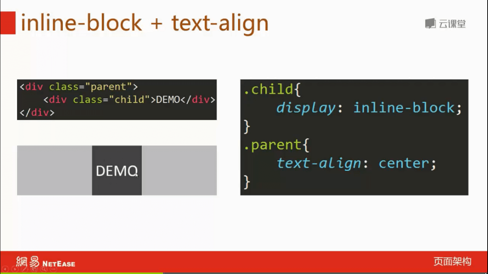
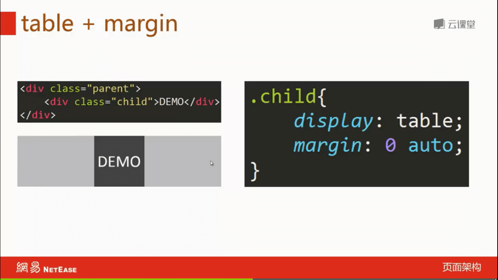
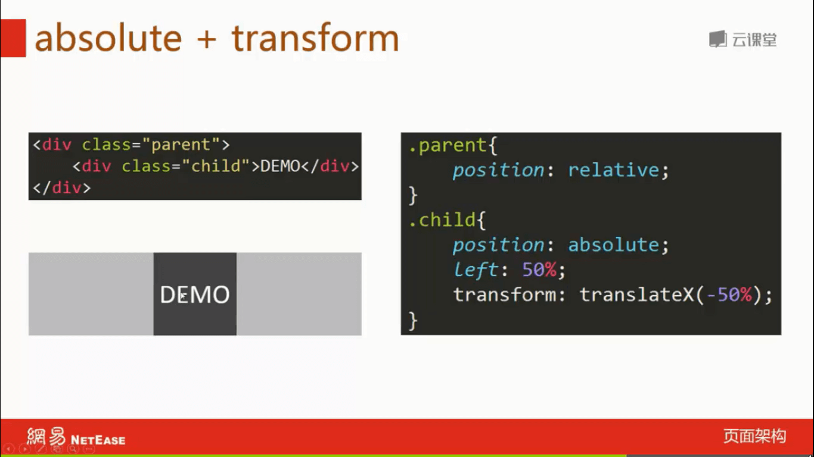
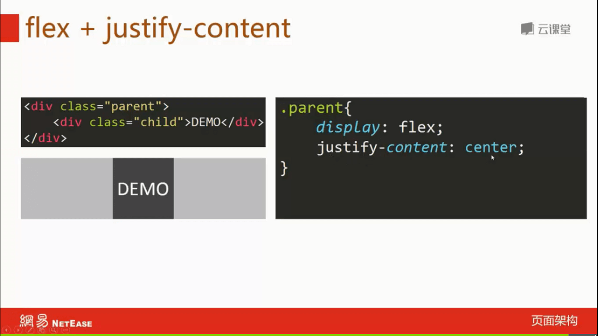
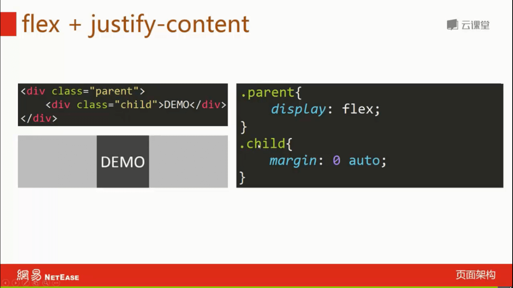
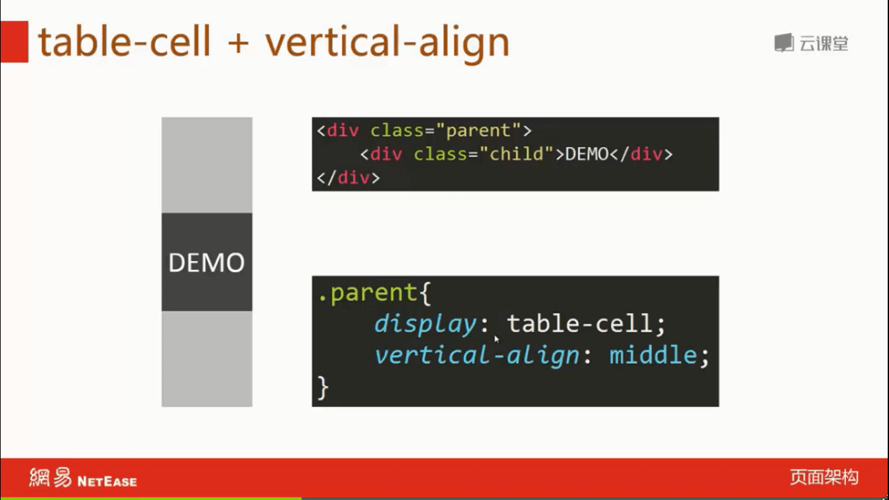
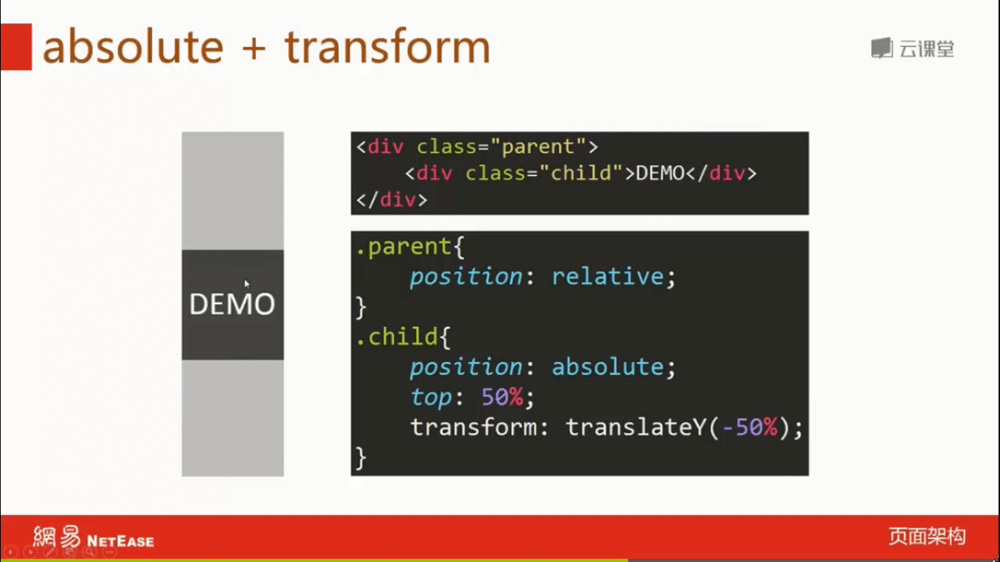
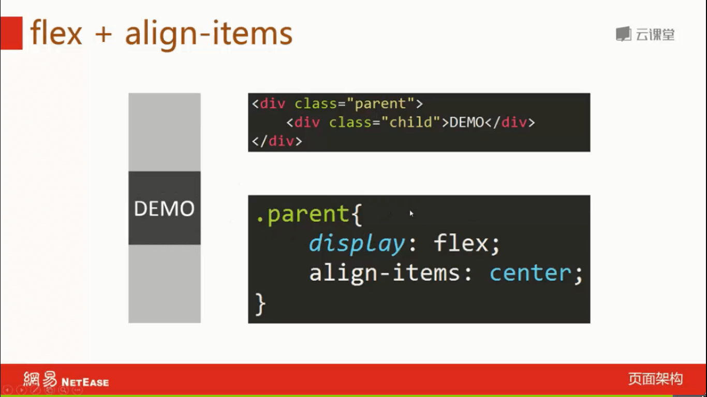

## 外部调用CSS的写法

```html
<link rel="stylesheet" href="Css/addStyle.css" type="text/css"/>
```

## 修改默认CSS样式，定义文件编码

[normalize.css](res/normalize.css)

## 兼容ie9以及EDGE

```html
<meta http-equiv="X-UA-Compatible" content="IE=EDGE">
```

## 适应移动设备以及允许缩放

```html
<meta name="viewport" content="width=device-width, initial-scale=1, maximum-scale=2, user-scalable=yes">
```

## 在CSS中引入外部CSS

```css
@import url("animate.css");
```

## 点击穿透

```css
.demo {
    pointer-events: none;
}
```

## 内部边框

```css
.contact_banner {
    border: 42px solid #ff674d;
    box-sizing: border-box;
    -moz-box-sizing: border-box;
    -webkit-box-sizing: border-box;
}
```

## checkbox勾选后文字变色

```css
.time_con ul li input[type=checkbox]:checked+.cb-label{
    background: #f58612;
}
.time_con ul li input[type=checkbox]:checked+.cb-label+.time_info{
    color: #f58612;
}
```

## 偶数显示背景色

```css
.news-list:nth-of-type(even) {
    background-color: #fafafa;
}
```

## 大写字母

```css
h1 {text-transform:uppercase}
h2 {text-transform:capitalize}
p {text-transform:lowercase}
```

## 自然段缩进2个空格

```css
.demo {
 text-indent:2em;
}
```

## CSS在前面和后面追加内容

```css
#xn_n_18_navHome>a:before {
    content:'HOME';
}

p:after {
    content:"台词：";
}
```

## 切字，多的字显示“...”

```css
.xn_c_34_lbenname {
    overflow: hidden;
    text-overflow: ellipsis;
    white-space: nowrap;
    max-width: 470px;
}
```

## input 选中（:focus）边框

```css
.demo {
    outline-color: rgb(77, 144, 254);
}

.con3input:focus,.con3texta:focus {
    border-color: #ffe345
}
::-webkit-input-placeholder { /* WebKit browsers */
    color: #ffffff;
}
:-moz-placeholder { /* Mozilla Firefox 4 to 18 */
    color: #ffffff;
}
::-moz-placeholder { /* Mozilla Firefox 19+ */
    color: #ffffff;
}
:-ms-input-placeholder { /* Internet Explorer 10+ */
    color: #ffffff;
}
```

## textarea 固定大小

`resize: none;`

## 点击按钮不提交刷新页面

`<button type="button">提交</button>`

## 使元素变大

```css
transform: scale(2.0);
```

## 禁止鼠标选择

```css
.article-holder.unable-reprint {
    user-select: none;
    -webkit-user-select: none;
}
```

## CSS实现水平居中







## CSS实现垂直居中



