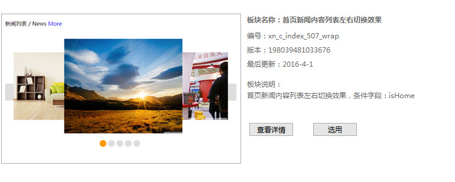

# 伪3D三联装图片轮播



```html
<!--xn_c_index_507_wrap-->
<div id="xn_c_index_507_wrap" class="xn_c_index_507_wrap" ds_block_id="2237" ds_number="xn_c_index_507_wrap" ds_v="198039481033676"
    is_design_source="true" design_source_area="ea_c">
    <!--首页新闻内容列表左右切换焦点切换效果 start 20160307-->
    <div class="xn_c_index_507_topbox">
        <span class="xn_c_index_507_cnName">
            <!--ea_span_index_507_cnName-->
            <span name="_index_507_cnName">新闻列表</span>
            <!--ea_span_index_507_cnName-->
        </span>
        <span class="xn_c_index_507_online">
            <!--ea_span_index_507_online-->
            <span name="_index_507_online">/</span>
            <!--ea_span_index_507_online-->
        </span>
        <span class="xn_c_index_507_enName">
            <!--ea_span_index_507_enName-->
            <span name="_index_507_enName">News</span>
            <!--ea_span_index_507_enName-->
        </span>
        <span class="xn_c_index_507_tmore">
            <a href="news.aspx?FId=n2:2:2">
                <!--ea_span_index_507_tmore-->
                <span name="_index_507_tmore">More</span>
                <!--ea_span_index_507_tmore-->
            </a>
        </span>
    </div>
    <div class="xn_c_index_507_inner">
        <em class="xn_c_index_507_prev"></em>
        <div class="xn_c_index_507_cbox">
            <ul class="xn_c_index_507_ul">
                <ShoveEIMS3:ShoveWebControl_Data id="xn_c_index_507_Data" runat="server" DS-NavigateId="2" DS-DataType="PC数据" DS-TypeId=""
                    DS-Id="" DS-TableType="内容数据" DS-Orders="[Order],[DateTime] desc" DS-Condition="isHome" StP-SplitePage="True"
                    StP-PageSize="1" StP-PageIndex="1" StP-PiParaName="pageindex" StP-PagingerId="" ReceivePageSize="True">
                    <ItemTemplate>
                        <li class="xn_c_index_507_li">
                            <div class="xn_c_index_507_img">
                                <a target="_blank" href='<%# ((DataHelper.IData)Container.DataItem).GetPropertyToString("outLinks") %>'>
                                    ' alt='<%# ((DataHelper.IData)Container.DataItem).GetPropertyToString("Title") %>'
                                        title='<%# ((DataHelper.IData)Container.DataItem).GetPropertyToString("Title") %>' />
                                </a>
                            </div>
                            <div class="xn_c_index_507_title">
                                <a target="_blank" href='<%# ((DataHelper.IData)Container.DataItem).GetPropertyToString("outLinks") %>'>
                                    <%# ((DataHelper.IData)Container.DataItem).GetPropertyToString("Title") %>
                                </a>
                            </div>
                        </li>
                    </ItemTemplate>
                </ShoveEIMS3:ShoveWebControl_Data>
            </ul>
        </div>
        <em class="xn_c_index_507_next"></em>
        <div id="xn_c_index_507_nums" class="xn_c_index_507_nums"></div>
    </div>
    <!--首页新闻内容列表左右切换焦点切换效果 end-->
    <c_attribute r_database="nid:2;type_ids:28;t_fields:ParentId,Id,NavigateId,isShow,LinkUrl,Order,Name,Introduce;c_fields:28=DateTime,Title,ImageUrl,isHot,isShow,TypeId,id,Author,ClickCount,Content"
        url="news_view.aspx"></c_attribute>
</div>
<!--end_xn_c_index_507_wrap-->
```

```css
/*xn_c_index_507_wrap*/
.xn_c_index_507_wrap{width:685px;height:auto;overflow:hidden;margin:20px auto;}
.xn_c_index_507_topbox{height:50px;line-height:50px;overflow:hidden;}
.xn_c_index_507_inner{height:auto;overflow:hidden;position:relative;}
.xn_c_index_507_cbox{width:635px;height:280px;overflow:hidden;position:relative;margin:20px auto;}
.xn_c_index_507_cbox ul{width:9999em;height:200px;margin-top:40px;}
.xn_c_index_507_li{width:300px;height:200px;overflow:hidden;position:absolute;left:635px;top:40px;z-index:23;background-color:#eee;}
.xn_c_index_507_img{width:100%;height:100%;overflow:hidden;}
.xn_c_index_507_img img{width:100%;height:100%;}
/* 第一张作为中间大图 */
.xn_c_index_507_li.iscurr{width:350px;height:280px;left:150px;top:0;z-index:25;}
/* 第二张层级设置 */
.xn_c_index_507_li1{left:335px;z-index:24;}
/* 最后一张左为0 */
.xn_c_index_507_li.islast{left:0;}
.xn_c_index_507_title{display:none;}
.xn_c_index_507_prev,.xn_c_index_507_next{width:25px;height:50px;position:absolute;top:45%;background-color:#ddd;z-index:33;cursor:pointer;}
.xn_c_index_507_prev:hover,.xn_c_index_507_next:hover{background-color:#F90;}
.xn_c_index_507_prev{left:0;}
.xn_c_index_507_next{right:0;}
.xn_c_index_507_nums{height:20px;overflow:hidden;text-align:center;}
.xn_c_index_507_nums span{width:20px;height:20px;border-radius:20px;background-color:#ddd;display:inline-block;margin-right:5px;cursor:pointer;}
.xn_c_index_507_nums span.curr{background-color:#F90;}
/*end_xn_c_index_507_wrap*/
```

```js
/*xn_c_index_507_wrap*/
$(function(){
    if($("#xn_c_index_507_wrap").length > 0) {
        var isAutoPlay = true;   //是否自动
        var speed = 600;        //速度
        var cul = $(".xn_c_index_507_ul");
        var cli = $(".xn_c_index_507_li");
        var nums = $(".xn_c_index_507_nums");
        var count = cli.length;
        var index = 0;
        var curr_index = 0;
        var pn_index = 0;
        //初始化
        cli.each(function(){
            $(this).attr("mark",$(this).index());
            $(this).addClass("xn_c_index_507_li"+$(this).index());
            nums.append("<span></span>");
            if($(this).index() == 0){
                $(this).addClass("iscurr");
            }
            if($(this).index() == (count-1)){
                $(this).addClass("islast");
            }
        });
        nums.find("span:first").addClass("curr");
        //获取相关参数
        var cbox_w = $(".xn_c_index_507_cbox").width();
        var iscurr = cul.children(".iscurr");
        var iscurr_w = iscurr.width();
        var iscurr_h = iscurr.height();
        var iscurr_left = parseInt(iscurr.css("left"));
        var cli_w = cli.eq(index+1).width();
        var cli_h = cli.eq(index+1).height();
        var cli_left = parseInt(cli.eq(index+1).css("left"));
        var cli_top = parseInt(cli.eq(index+1).css("top"));
        //左右切换
        function movePrev(){
            curr_index = index;
            index--;
            if(index < 0){
                index = count-1;
            }
            //当前元素
            cli.eq(curr_index).stop().animate({"width":cli_w,"height":cli_h,"left":cli_left,"top":cli_top,"z-index":"24"},speed).next().css("z-index","23");
            //切换后当前元素
            cli.eq(index).stop().animate({"width":iscurr_w,"height":iscurr_h,"left":iscurr_left,"top":"0px","z-index":"25"},speed);
            //切换后当前元素下一个元素
            cli.eq(index-1).css({"left":"-100%","z-index":"22"}).stop().animate({"left":"0px","z-index":"23"},speed);
            //焦点元素切换
            nums.find("span").eq(index).addClass("curr").siblings().removeClass("curr");
        }
        function moveNext(){
            curr_index = index;
            index++;
            if(index > (count-1)){
                index = 0;
            }
            if(curr_index == 0){
                pn_index = count-1;
            }else{
                pn_index = curr_index-1;
            }
            //当前元素
            if(index == (count-1)){
                cli.eq(0).stop().animate({"left":cli_left,"z-index":"24"},speed);
            }else{
                cli.eq(index+1).stop().animate({"left":cli_left,"z-index":"24"},speed);
            }
            //切换后当前元素
            cli.eq(index).stop().animate({"width":iscurr_w,"height":iscurr_h,"left":iscurr_left,"top":"0px","z-index":"25"},speed,function(){
                cli.eq(pn_index).css({"left":cbox_w,"z-index":"23"});
            });
            //切换后当前元素下一个元素
            cli.eq(curr_index).stop().animate({"width":cli_w,"height":cli_h,"left":"0px","top":cli_top,"z-index":"23"},speed);
            //焦点元素切换
            nums.find("span").eq(index).addClass("curr").siblings().removeClass("curr");
        }
        $(".xn_c_index_507_prev").bind("click",function(){
            movePrev();
        });
        $(".xn_c_index_507_next").bind("click",function(){
            moveNext();
        });
        //是否自动切换
        if(isAutoPlay){
            var isAuto = setInterval(moveNext,3000);
            $(".xn_c_index_507_inner").hover(function(){
                clearInterval(isAuto);
            },function(){
                isAuto = setInterval(moveNext,3000);
            });
        }
    }
});
/*end_xn_c_index_507_wrap*/
```