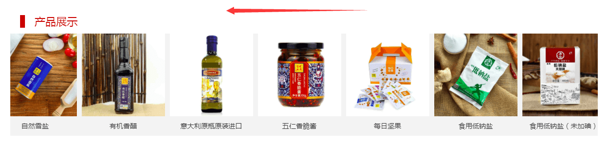

# 无限横向滚动轮播



```html
<!--xn_c_index_192_wrap-->
<div id="xn_c_index_192_wrap" class="xn_c_index_192_wrap">
    <!--首页产品跑马灯外链列表开始-->
    <div class="xn_c_index_192_topbox">
        <!--ea_span_index_192_pro_t1-->
        <span name="_index_192_pro_t1">产品展示</span>
        <!--ea_span_index_192_pro_t1-->
    </div>
    <div id="xn_c_index_192_main" class="xn_c_index_192_main">
        <div id="xn_c_index_192_left" class="xn_c_index_192_left">
        </div>
        <div id="xn_c_index_192_inner" class="xn_c_index_192_inner">
            <ul id="xn_c_index_192_ul" class="xn_c_index_192_ul">
                <ShoveEIMS3:ShoveWebControl_Data ID="xn_c_index_192_Data" runat="server" DS-NavigateId="3" ReceivePageIndex="True" ReceiveTypeId="True"
                    ReceivePageSize="True" DS-Condition="isHot" DS-Orders="[Order],[DateTime] DESC" DS-TableType="内容数据" DS-Id=""
                    DS-TypeId="" StP-PagingerId="" StP-PiParaName="pageindex" StP-PageIndex="1" StP-PageSize="50" StP-SplitePage="True">
                    <ItemTemplate>
                        <li class="xn_c_index_192_li" id="xn_c_index_192_li">
                            <div class="xn_c_index_192_nrbox">
                                <div class="xn_c_index_192_lftbox">
                                    <a target="_blank" href='<%# ((DataHelper.IData)Container.DataItem).GetPropertyToString("outlinks") %>'>
                                        ' alt='<%# ((DataHelper.IData)Container.DataItem).GetPropertyToString("Name") %>'
                                            title='<%# ((DataHelper.IData)Container.DataItem).GetPropertyToString("Name") %>'
                                        />
                                    </a>
                                    <div class="xn_c_index_192_name">
                                        <a target="_blank" href='<%# ((DataHelper.IData)Container.DataItem).GetPropertyToString("outlinks") %>'>
                                            <%# ((DataHelper.IData)Container.DataItem).GetPropertyToString("Name") %>
                                        </a>
                                    </div>
                                </div>
                                <div class="xn_c_index_192_ritbox">
                                    <div class="xn_c_index_192_time">
                                        <span class="xn_c_index_192_tmname">
                                            <!--ea_span_index_192_tmname-->
                                            <span name="_index_192_tmname">发布时间:</span>
                                            <!--ea_span_index_192_tmname-->
                                        </span>
                                        <span class="xn_c_index_192_date1">
                                            <ShoveEIMS3:ShoveWebControl_Text ID="xn_c_index_192_Text1" runat="server" DateShowType="1974-03-07" ShowDateContent="只显示年"
                                                Text='<%# ((DataHelper.IData)Container.DataItem).GetPropertyToString("DateTime") %>'
                                                IsChange="False"></ShoveEIMS3:ShoveWebControl_Text>
                                        </span>
                                        <span class="xn_c_index_192_date2">-</span>
                                        <span class="xn_c_index_192_date3">
                                            <ShoveEIMS3:ShoveWebControl_Text ID="xn_c_index_192_Text2" runat="server" DateShowType="1974-03-07" ShowDateContent="只显示月"
                                                Text='<%# ((DataHelper.IData)Container.DataItem).GetPropertyToString("DateTime") %>'
                                                IsChange="False"></ShoveEIMS3:ShoveWebControl_Text>
                                        </span>
                                        <span class="xn_c_index_192_date4">-</span>
                                        <span class="xn_c_index_192_date5">
                                            <ShoveEIMS3:ShoveWebControl_Text ID="xn_c_index_192_Text3" runat="server" DateShowType="1974-03-07" ShowDateContent="只显示日"
                                                Text='<%# ((DataHelper.IData)Container.DataItem).GetPropertyToString("DateTime") %>'
                                                IsChange="False"></ShoveEIMS3:ShoveWebControl_Text>
                                        </span>
                                    </div>
                                    <div class="xn_c_index_192_coent" ej="edit_span">
                                        <ShoveEIMS3:ShoveWebControl_Text ID="xn_c_index_192_Text4" runat="server" Text='<%# ((DataHelper.IData)Container.DataItem).GetPropertyToString("Introduce") %>'
                                            CutWords="600" IsChange="False" IsFilterHtmlTag="true">
                                        </ShoveEIMS3:ShoveWebControl_Text>
                                    </div>
                                </div>
                            </div>
                        </li>
                    </ItemTemplate>
                </ShoveEIMS3:ShoveWebControl_Data>
            </ul>
        </div>
        <div id="xn_c_index_192_right" class="xn_c_index_192_right">
        </div>
        <div class="clear"></div>
    </div>
    <!--首页产品跑马灯外链列表结束-->

</div>
<!--end_xn_c_index_192_wrap-->
```

```css
/*xn_c_index_192_wrap*/
.xn_c_index_192_wrap{width:100%;position: relative;margin: 35px auto;}
.xn_c_index_192_topbox{display: block;
    width: 100%;
    color: #bd0000;
    font-size: 22px;
    height: 50px;
    line-height: 50px;
    text-indent: 50px;}
.xn_c_index_192_topbox:before {
    content: "";
    width: 10px;
    height: 26px;
    position: absolute;
    top: 12px;
    left: 20px;
    display: block;
    background: #bd0000;
}
.xn_c_index_192_main{position:relative;width:1200px;}
.xn_c_index_192_ritbox{display: none;}
.xn_c_index_192_left{height:75px;width:30px;background:#000;cursor:pointer;position:absolute;margin-top:100px;left:0px;z-index:999;display: none;}
.xn_c_index_192_right{height:75px;width:30px;background:#000;cursor:pointer;position:absolute;margin-top:100px;right:0px;z-index:999;display: none}
.xn_c_index_192_inner{position:relative;float:left;width:100%;overflow:hidden;margin:0px 0px;}
.xn_c_index_192_ul{position:relative;float:left;width:440px; background: #f3f3f3;}
.xn_c_index_192_li{float:left;margin:0px;width:170px; height: 210px;margin: 0px 5px; background: #FFF;}
.xn_c_index_192_nrbox{width:170px; height: 210px;}
.xn_c_index_192_name{width: 100%;height: 40px;line-height: 40px;overflow: hidden;text-align: center;background: #f3f3f3;}
.xn_c_index_192_name a{color: #323232;font-size: 14px;}
.xn_c_index_192_name a:hover{color: #bd0000;}
.xn_c_index_192_lftbox img{width:170px; height:170px;}
.xn_c_index_192_coent{width:200px;height:44px;line-height:22px;overflow:hidden;}
/*end_xn_c_index_192_wrap*/
```

```js
/*xn_c_index_192_wrap*/
$.fn.imgscroll = function (o) {
    var defaults = {
        speed: 40,
        amount: 0,
        width: 1,
        dir: "left"
    };
    o = $.extend(defaults, o);
    return this.each(function () {
        var _li = $("li", this);
        //初始大小
        var _li_size = 0;
        for (var i = 0; i < _li.size(); i++)
            _li_size += _li.eq(i).outerWidth(true);
        //循环所需要的元素
        if (o.dir == "left") _li.parent().css({
            width: (_li_size * 3) + "px"
        });
        _li.parent().empty().append(_li.clone()).append(_li.clone()).append(_li.clone());
        _li = $("li", this);
        //滚动
        var _li_scroll = 0;

        function goto() {
            _li_scroll += o.width;
            if (_li_scroll > _li_size) {
                _li_scroll = 0;
                _li.parent().css({
                    left: -_li_scroll
                });
                _li_scroll += o.width;
            }
            _li.parent().animate({
                left: -_li_scroll
            }, o.amount);
        }
        //开始
        var move = setInterval(function () {
            goto();
        }, o.speed);
        _li.parent().hover(function () {
            clearInterval(move);
        }, function () {
            clearInterval(move);
            move = setInterval(function () {
                goto();
            }, o.speed);
        });
    });
};
$(document).ready(function () {
    $(".xn_c_index_192_ul").imgscroll({
        speed: 30, //图片滚动速度
        amount: 0, //图片滚动过渡时间
        width: 1, //图片滚动步数
        dir: "left" // "left" 或 "up" 向左或向上滚动
    });
});
/*end_xn_c_index_192_wrap*/
```