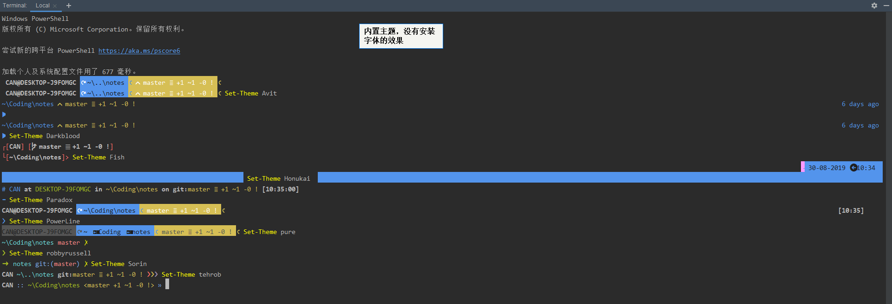

# 在 Powershell 安装 oh-my-posh

```powershell
Install-Module posh-git -Scope CurrentUser
Install-Module oh-my-posh -Scope CurrentUser
Import-Module oh-my-posh
# 如果执行出错：因为在此系统上禁止运行脚本，请使用管理权限运行命令：set-executionpolicy remotesigned
Import-Module oh-my-posh
Set-Theme Agnoster
# 输入 $profile 查看默认配置文件地址，编辑默认配置文件，输入上面2行即可每次自动加载配置
```



## 参考

- https://blog.walterlv.com/post/beautify-powershell-like-zsh.html
